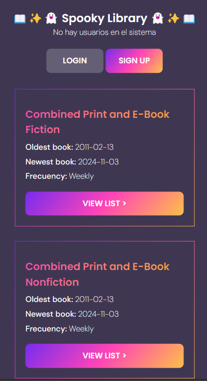
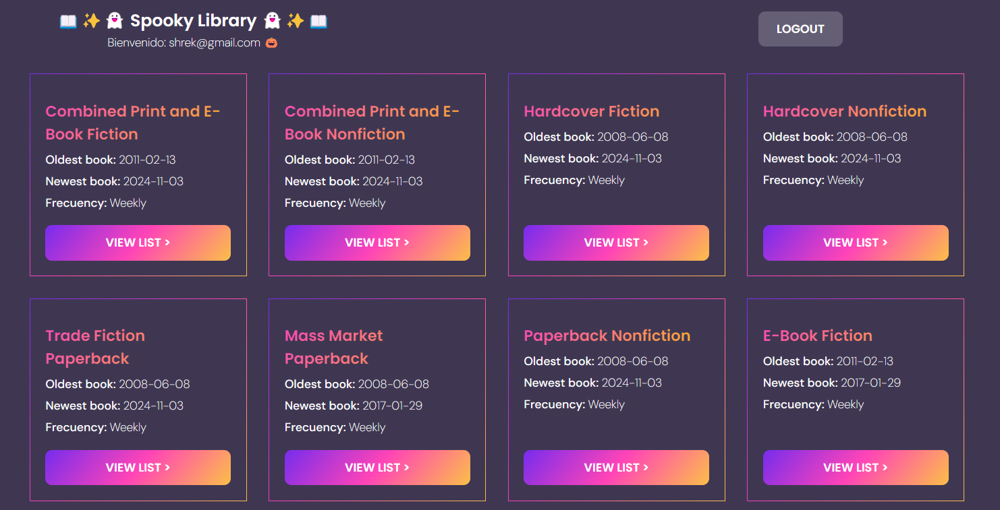
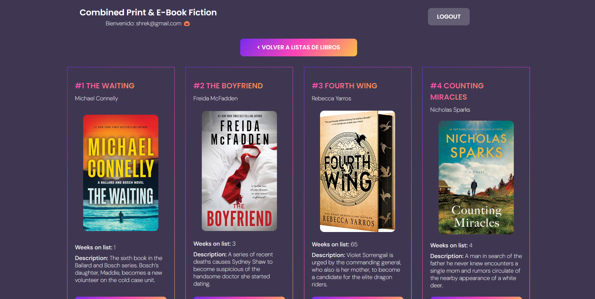

# Library Dashboard 📚

This project offers a **book list dashboard** available through the **Books API**. It allows users to explore book lists and access detailed information, such as book rankings, descriptions, purchase links, and more.

## 🚀 Project Requirements

This project was developed following these guidelines:

- **Dynamic DOM manipulation**
- **Use of ES6+**
- **Asynchronous handling** for API management
- **No frameworks** or external libraries whenever possible
- **Version control with Git and GitHub** using branches from the start
- **Good coding practices** and clean code
- **Responsive design and HTML5 semantics**


## ✨ Features

- **Responsive Design**: The website is optimized for various screen sizes, ensuring a seamless experience across devices with a Mobile-First approach.
- **User-Centered UI/UX**: A visually pleasing, user-friendly interface designed to provide an enjoyable and intuitive navigation experience.
- **Dynamic API Integration**: Real-time data fetching and display from the Books API, making the content dynamic and always up-to-date.
- **Detailed Book Information**: Each list includes detailed book descriptions, cover images, position, and links to purchase.
- **Smooth Loading Animation**: A loading animation offers a better experience while waiting for content to load.
- **User Authentication**: Firebase Authentication for secure user sign-in, providing a personalized experience.

## 📸 Some screenshots
 
 
 


## 📁 Project Structure

```bash
├── index.html        # Main landing page
├── script.js         # JS file
├── styles.css        # CSS file
└── README.md        # README file
```


## 💻 Technologies Used

| Logo                                                                                           | Description                                                        |
|------------------------------------------------------------------------------------------------|--------------------------------------------------------------------|
|  | **HTML5**: For the website's structure and layout.               |
|  | **CSS3**: To style the website and ensure responsive design.      |
|  | **JavaScript**: To create interactive and dynamic elements, especially for the mobile menu and the form inside the contact section. |
|  | **Firebase Auth**: For user authentication.    |
|  | **GitHub Pages**: For hosting the live version of the website.    |
|


## 📦 APIS and libraries used

| Logo                                                                                           | Description                                                        |
|------------------------------------------------------------------------------------------------|--------------------------------------------------------------------|
|  | **NY Times Books API**: A free-to-use API that provides a vast collection of trivia questions across various categories, enabling dynamic quiz creation and engagement.               |
| 


## 🌱 Challenges Faced

- Carefully reviewing the route of specific lists in the **NY Times Books API** documentation and implementing the logic to dynamically attach it within each `addEventListener`, ensuring seamless connectivity with the unique ID of each button.
- Connecting with **Firebase Auth** and managing events across three buttons: **Log In, Logout,** and **Sign Up**. This required verifying that the authentication functionality was correctly reflected in Firebase.
- **Time management and organization**: Balancing project deadlines with effective planning and task prioritization to stay on track.


## 🛠️ Future Improvements

- **Email Validation with Regex**: Implement regex checks in the Sign Up and Log In forms to ensure valid email formatting.
- **User Verification on Sign In**: Check if a user exists in the system during sign-in, and display a warning if the user input is incorrect.
- **Favorites System**: Create a favorites feature linked to each user via **Firebase Firestore**. Add a complementary page where users can view and manage their favorite books.
- **Integration with Firebase Cloud Storage**: Allow users to upload profile pictures, storing the image URL in their Firebase Firestore document.
- **Search by List and Book Name**: Add search functionality for easy lookup of lists and specific books.
- **Book Category Filters**: Implement a filter system to sort books by category, making it easier for users to find relevant content.
